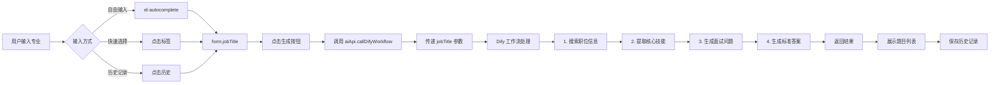

# 智能专业题目生成器 - 最佳实践方案

## 📋 问题分析

### 原有实现的限制
之前的实现存在以下问题：
1. **固定专业列表**：`difyService.js` 中预定义了15个专业选项
2. **用户选择受限**：用户只能从下拉菜单中选择，无法输入自定义专业
3. **与Dify工作流不匹配**：Dify工作流本身支持接受**任意 `job_title` 输入**，但前端限制了这个能力

### Dify 工作流能力
根据配置文件 `D:\code7\test5\AI 面试官 - 全流程定制与评分 (RAG) (2).yml`，工作流支持：
- ✅ 接受任意职位名称作为输入（`job_title` 参数）
- ✅ 自动通过搜索引擎搜索该职位的相关信息
- ✅ 提取核心技能和职责
- ✅ 生成5个开放性面试问题
- ✅ 为每个问题生成标准答案（RAG增强）

## 🎯 最佳实践方案

### 核心设计原则
1. **自由输入优先**：主输入框允许用户输入任何专业/职位
2. **智能建议辅助**：提供自动完成和快速选择，但不限制输入
3. **直接调用工作流**：将用户输入的专业名称直接传递给Dify工作流
4. **用户体验优化**：提供历史记录、进度提示、结果展示等功能

### 实现方案

#### 1. 新建专用页面组件
创建 `SmartQuestionGenerator.vue` 组件，专门用于自由输入专业生成题目。

**路由地址**: `/ai/smart-generator`

#### 2. 核心功能特性

##### 输入方式
- **主输入框**: `el-autocomplete` 组件
  - 支持自由输入任何文本
  - 提供自动完成建议
  - 无输入限制

- **快速选择标签**: 常用专业的快捷按钮
  - 点击即可填充到输入框
  - 用户仍可修改
  - 提供8个高频专业

- **自动完成数据源**:
  ```javascript
  const allProfessionsSuggestions = ref([
    { value: '前端开发工程师', label: '前端开发', icon: '🌐' },
    { value: 'Python后端开发工程师', label: 'Python后端', icon: '🐍' },
    // ... 更多建议，但不限制用户输入
  ])
  ```

##### 工作流调用
```javascript
const handleGenerate = async () => {
  // 直接使用用户输入的职位名称
  const response = await aiApi.callDifyWorkflow({
    requestType: 'generate_questions',
    jobTitle: form.jobTitle  // 用户输入的任何文本
  })
}
```

##### 结果处理
```javascript
if (response.code === 200 && response.data) {
  const { generated_questions, session_id } = response.data

  result.value = {
    jobTitle: form.jobTitle,
    sessionId: session_id,
    timestamp: Date.now(),
    questions: generated_questions || []
  }
}
```

#### 3. 用户体验优化

##### 进度提示
- 显示当前执行步骤
- 进度条动态更新
- 预计耗时提示（30-60秒）

##### 历史记录
- 自动保存最近10次生成记录
- 存储在 `localStorage`
- 点击历史记录快速加载

##### 结果展示
- 折叠面板显示所有题目
- 每个题目包含：问题、标准答案
- 支持复制题目、复制答案
- 支持导出为JSON格式

#### 4. 与现有系统集成

##### 后端API调用
```javascript
// 调用 /api/ai/dify-workflow
await aiApi.callDifyWorkflow({
  requestType: 'generate_questions',
  jobTitle: form.jobTitle  // 任意职位名称
})
```

##### 数据流转
```
用户输入 → SmartQuestionGenerator.vue
         → aiApi.callDifyWorkflow()
         → backend/mock-server.js
         → Dify API
         → 返回结果展示
```

## 🚀 使用方法

### 访问页面
```
http://localhost:5174/ai/smart-generator
```

### 操作步骤
1. **输入专业名称**
   - 直接在输入框输入任何专业（如："区块链开发工程师"）
   - 或点击快速选择标签
   - 或从自动完成建议中选择

2. **点击生成**
   - 点击"开始生成面试题目"按钮
   - 等待30-60秒（AI搜索+生成）

3. **查看结果**
   - 展开折叠面板查看每个题目
   - 复制题目或答案
   - 导出为JSON文件

4. **历史记录**
   - 查看最近生成的专业
   - 点击快速加载

## 📊 与原实现对比

| 特性 | 原实现 | 新实现 |
|------|--------|--------|
| 专业输入 | 固定15个选项 | 任意输入 |
| 自动完成 | 无 | 有 |
| 历史记录 | 无 | 有（localStorage） |
| 进度提示 | 无 | 有（详细步骤） |
| 结果展示 | 基础 | 优化（折叠面板） |
| 快速选择 | 下拉菜单 | 标签点击 |
| 导出功能 | 复杂 | 简化（JSON） |

## 🔧 技术实现细节

### 核心组件
- **输入控件**: `el-autocomplete`（Element Plus）
- **快速选择**: `el-tag`（可点击）
- **结果展示**: `el-collapse`（折叠面板）
- **进度提示**: `el-progress` + 步骤文本

### 状态管理
```javascript
const form = reactive({
  jobTitle: ''  // 唯一输入字段
})

const result = ref(null)  // 生成结果
const generationHistory = ref([])  // 历史记录
```

### 数据持久化
```javascript
// 保存到 localStorage
localStorage.setItem('smart_generation_history', JSON.stringify(history))

// 加载历史
const stored = localStorage.getItem('smart_generation_history')
```

## 🎨 UI/UX 优化

### 视觉层次
1. **顶部**: 工作流程说明（info alert）
2. **左侧**: 配置区域（输入+快速选择）
3. **右侧**: 结果展示区域（折叠面板）

### 交互反馈
- ✅ 加载状态：进度条 + 步骤文本
- ✅ 成功提示：`ElMessage.success`
- ✅ 错误处理：`ElMessage.error`
- ✅ 空状态：`el-empty` 组件

### 响应式设计
- 使用 `el-row` 和 `el-col` 栅格系统
- 左侧占 10 列，右侧占 14 列
- 适配不同屏幕尺寸

## 📝 代码示例

### 自由输入 + 自动完成
```vue
<el-autocomplete
  v-model="form.jobTitle"
  :fetch-suggestions="querySearch"
  placeholder="请输入任意专业名称，如：前端开发工程师"
  clearable
  style="width: 100%"
  size="large"
>
  <template #prefix>
    <el-icon><Search /></el-icon>
  </template>
</el-autocomplete>
```

### 快速选择标签
```vue
<div class="quick-tags">
  <el-tag
    v-for="prof in popularProfessions"
    :key="prof.value"
    @click="selectProfession(prof.value)"
    effect="plain"
  >
    {{ prof.icon }} {{ prof.label }}
  </el-tag>
</div>
```

### 调用Dify工作流
```javascript
const response = await aiApi.callDifyWorkflow({
  requestType: 'generate_questions',
  jobTitle: form.jobTitle  // 用户输入的任何值
})
```

## 🔄 工作流程图



## ✅ 优势总结

### 1. 灵活性
- ✅ 支持任意专业输入
- ✅ 不受预定义列表限制
- ✅ 充分发挥Dify工作流能力

### 2. 用户体验
- ✅ 自动完成提升效率
- ✅ 快速选择常用专业
- ✅ 历史记录便于重复使用

### 3. 可维护性
- ✅ 代码结构清晰
- ✅ 组件职责单一
- ✅ 易于扩展新功能

### 4. 性能优化
- ✅ 本地存储历史记录
- ✅ 进度提示提升感知
- ✅ 折叠面板节省空间

## 🚧 未来扩展

### 可能的增强功能
1. **AI推荐专业**：根据用户历史智能推荐
2. **专业验证**：检查输入的专业是否合理
3. **批量生成**：一次生成多个专业的题目
4. **题目收藏**：保存喜欢的题目到题库
5. **分享功能**：生成分享链接
6. **评分功能**：对生成的题目进行评价

### 集成面试功能
将生成的题目直接用于面试：
```javascript
const startInterview = (question) => {
  router.push({
    path: '/interview/session',
    query: {
      question: question.question,
      sessionId: result.value.sessionId
    }
  })
}
```

## 📚 相关文件

### 新增文件
- `frontend/src/views/ai/SmartQuestionGenerator.vue` - 主组件

### 修改文件
- `frontend/src/router/index.js` - 添加路由

### 参考文件
- `D:\code7\test3\7.txt` - Dify工作流文档
- `D:\code7\test5\AI 面试官 - 全流程定制与评分 (RAG) (2).yml` - Dify配置

## 🎓 总结

这个最佳实践方案的核心理念是：
1. **不限制用户输入** - 支持任意专业名称
2. **提供智能辅助** - 自动完成和快速选择
3. **直接调用工作流** - 充分利用Dify的RAG能力
4. **优化用户体验** - 进度提示、历史记录、结果展示

通过这种方式，用户可以输入任何专业（包括："量子计算工程师"、"元宇宙设计师"、"Web3开发者" 等），系统都能通过Dify工作流自动搜索相关信息并生成高质量的面试题目。

---

**创建时间**: 2025-10-10
**文档版本**: 1.0
**作者**: Claude Code
