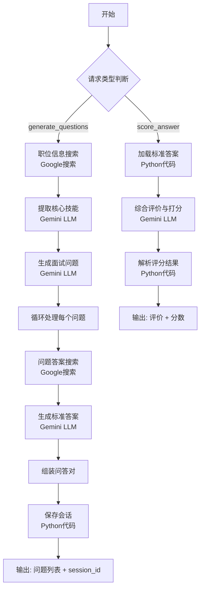

# Dify 工作流分析与解决方案

## 📋 概述

本文档深入分析您的 Dify "AI 面试官 - 全流程定制与评分 (RAG)" 工作流配置，识别常见问题，并提供具体的优化和修改方案。

## 🔍 工作流架构分析

### 基本信息
- **工作流名称**: AI 面试官 - 全流程定制与评分 (RAG)
- **模式**: workflow
- **版本**: 0.4.0
- **主要模型**: Gemini 2.5 Pro Preview (langgenius/gemini/google)

### 输入参数

| 参数名 | 类型 | 必填 | 说明 |
|--------|------|------|------|
| `job_title` | text-input | ❌ | 职位名称（例如：Python后端开发工程师）|
| `request_type` | text-input | ✅ | 请求类型（generate_questions 或 score_answer）|
| `question` | text-input | ❌ | 面试问题（评分时必填）|
| `candidate_answer` | paragraph | ❌ | 候选人回答（评分时必填）|
| `session_id` | text-input | ❌ | 会话ID（评分时必填）|

### 工作流执行流程



## 🐛 当前问题分析

### 问题 1: HTTP 500 错误

**错误日志**:
```
Failed to load resource: the server responded with a status of 500 (Internal Server Error)
logger.js:57  [ERROR] [Dify题目生成失败:] AxiosError: Request failed with status code 500
```

**可能原因**:

1. **Google 搜索工具配置问题**
   - 工作流中有 2 个 Google 搜索节点（职位信息搜索、问题答案搜索）
   - 需要 Google Custom Search API 密钥
   - 可能未正确配置或超出配额

2. **Gemini 模型调用失败**
   - 使用了 `gemini-2.5-pro-preview-06-05` 模型
   - 可能模型不可用或API配额用尽
   - 温度参数设置可能不合适

3. **会话存储代码问题**
   - `save_session` 和 `load_session` 节点使用 Python代码
   - 代码中有注释提示需要替换成实际的API调用
   - 当前是简化处理，可能导致存储失败

### 问题 2: 超时错误（10秒）

**错误日志**:
```
logger.js:57  [ERROR] [Dify题目生成失败:] AxiosError: timeout of 10000ms exceeded
```

**原因分析**:

工作流执行时间过长，主要耗时环节：

1. **Google 搜索（2次）**: 每次 2-5 秒
2. **Gemini LLM 调用（7次）**:
   - 提取核心技能: 5-10秒
   - 生成面试问题: 10-15秒
   - 循环5次生成标准答案: 每次 5-10秒
   - 综合评价: 5-10秒
3. **总预计时间**: 40-90秒（远超10秒超时）

### 问题 3: 数据格式不匹配

**前端发送的数据**:
```json
{
  "profession": "后端",
  "level": "中级",
  "count": 1
}
```

**工作流期望的输入**:
```json
{
  "job_title": "Python后端开发工程师",
  "request_type": "generate_questions"
}
```

**不匹配问题**:
- 前端发送 `profession`，工作流期望 `job_title`
- 前端发送 `level` 和 `count`，但工作流不使用这些参数

## 🔧 解决方案

### 解决方案 1: 修复数据格式不匹配（最重要）

#### 方案A: 修改前端代码（推荐）

修改 `frontend/src/services/difyService.js`:

```javascript
// 修改前
export async function generateQuestionByProfession(profession, level = '中级', count = 1) {
  const response = await aiApi.callDifyWorkflow({
    requestType: 'generate_questions',
    profession: profession,    // ❌ 错误：应该是 job_title
    level: level,              // ❌ 工作流不使用此参数
    count: count               // ❌ 工作流不使用此参数
  })
  return response
}

// 修改后
export async function generateQuestionByProfession(profession, level = '中级', count = 1) {
  const response = await aiApi.callDifyWorkflow({
    requestType: 'generate_questions',
    jobTitle: profession,      // ✅ 正确：使用 job_title
    // level 和 count 可以移除或保留用于前端逻辑
  })
  return response
}
```

修改 `backend/mock-server.js` 的API路由:

```javascript
// 修改前
app.post('/api/ai/dify-workflow', async (req, res) => {
  const { requestType, profession, level, count } = req.body

  const difyPayload = {
    inputs: {
      request_type: requestType,
      job_title: profession,  // 这里其实已经映射了，但前端发的是 profession
      // ...
    }
  }
})

// 修改后
app.post('/api/ai/dify-workflow', async (req, res) => {
  const { requestType, jobTitle, profession, level, count } = req.body

  // 兼容处理：支持新的 jobTitle 字段，同时兼容旧的 profession 字段
  const actualJobTitle = jobTitle || profession

  const difyPayload = {
    inputs: {
      request_type: requestType,
      job_title: actualJobTitle,
      // level 和 count 不传给 Dify，因为工作流不使用
    }
  }
})
```

#### 方案B: 修改 Dify 工作流（不推荐）

在 Dify 平台中修改"开始"节点，添加 `profession`、`level`、`count` 参数。但这会让工作流更复杂且不必要。

### 解决方案 2: 增加超时时间

#### 修改前端超时设置

文件: `frontend/src/api/ai.js`

```javascript
// 修改前
export const callDifyWorkflow = (data) => {
  return request({
    url: '/api/ai/dify-workflow',
    method: 'post',
    data,
    timeout: 10000  // ❌ 10秒太短
  })
}

// 修改后
export const callDifyWorkflow = (data) => {
  return request({
    url: '/api/ai/dify-workflow',
    method: 'post',
    data,
    timeout: 90000  // ✅ 增加到90秒
  })
}
```

#### 修改后端超时设置

文件: `backend/mock-server.js`

```javascript
// 在调用 Dify API 时增加超时
const response = await axios.post(DIFY_API_URL, difyPayload, {
  headers: {
    'Authorization': `Bearer ${DIFY_API_KEY}`,
    'Content-Type': 'application/json'
  },
  timeout: 90000  // 90秒
})
```

### 解决方案 3: 优化 Dify 工作流性能

#### 3.1 减少 Google 搜索次数

**当前**: 每个问题都搜索一次（5次搜索）

**优化**: 只搜索一次职位信息，重用搜索结果

#### 3.2 降低 LLM 温度参数

温度参数会影响响应速度：

| 节点 | 当前温度 | 建议温度 | 说明 |
|------|----------|----------|------|
| 提取核心技能 | 0.3 | 0.3 | ✅ 合适 |
| 生成面试问题 | 0.7 | 0.5 | 🔄 降低提高速度 |
| 生成标准答案 | 0.5 | 0.4 | 🔄 略微降低 |
| 综合评价与打分 | 0.6 | 0.5 | 🔄 略微降低 |

#### 3.3 简化 Prompt

过长的 Prompt 会增加处理时间，建议精简提示词。

#### 3.4 使用更快的模型

| 当前模型 | 替代方案 | 速度提升 |
|----------|----------|----------|
| gemini-2.5-pro-preview-06-05 | gemini-1.5-flash | 2-3倍 |

**注意**: 更快的模型可能质量略有下降，需要平衡。

### 解决方案 4: 实现真实的会话存储

当前 `save_session` 和 `load_session` 代码是简化版本，需要实现真实存储。

#### 选项 A: 使用 Redis

修改 `save_session` Python 代码:

```python
import json
import uuid
import redis

def main(qa_data: str) -> dict:
    # 连接 Redis
    r = redis.Redis(host='localhost', port=6379, db=0, decode_responses=True)

    # 生成session_id
    session_id = str(uuid.uuid4())

    # 存储到Redis，设置过期时间（如24小时）
    r.setex(f"interview_session:{session_id}", 86400, qa_data)

    return {
        "session_id": session_id
    }
```

修改 `load_session` Python 代码:

```python
import json
import redis

def main(session_id: str, question: str, qa_data: str) -> dict:
    # 连接 Redis
    r = redis.Redis(host='localhost', port=6379, db=0, decode_responses=True)

    # 从Redis加载
    stored_qa = r.get(f"interview_session:{session_id}")

    if not stored_qa:
        return {
            "loaded_standard_answer": "会话已过期或不存在"
        }

    # 解析并查找标准答案
    qa_list = json.loads(stored_qa)
    standard_answer = ""

    for qa in qa_list:
        if isinstance(qa, dict) and qa.get("question") == question:
            standard_answer = qa.get("answer", "")
            break

    if not standard_answer:
        standard_answer = "未找到该问题的标准答案"

    return {
        "loaded_standard_answer": standard_answer
    }
```

#### 选项 B: 使用后端 API

在 `backend/mock-server.js` 中添加会话存储端点:

```javascript
// 内存存储（简单实现）
const sessionStorage = new Map()

// 保存会话
app.post('/api/interview/sessions', (req, res) => {
  const { qa_data } = req.body
  const session_id = uuidv4()
  sessionStorage.set(session_id, qa_data)
  res.json({ session_id })
})

// 获取会话
app.get('/api/interview/sessions/:sessionId', (req, res) => {
  const { sessionId } = req.params
  const qa_data = sessionStorage.get(sessionId)

  if (!qa_data) {
    return res.status(404).json({ error: 'Session not found' })
  }

  res.json({ qa_data })
})
```

然后在 Dify 工作流的 Python 代码中调用这些API。

### 解决方案 5: 添加进度提示

由于工作流执行时间长，给用户反馈很重要：

#### 前端添加进度指示器

文件: `frontend/src/views/interview/AIInterviewSession.vue`

```vue
<template>
  <!-- 加载进度提示 -->
  <el-alert
    v-if="difyLoading"
    type="info"
    :closable="false"
    show-icon
  >
    <template #title>
      <div class="loading-progress">
        <el-icon class="is-loading"><Loading /></el-icon>
        <span>{{ loadingStage }}</span>
      </div>
    </template>
    <div class="progress-details">
      <el-progress :percentage="loadingProgress" :status="progressStatus" />
      <p class="progress-hint">{{ loadingHint }}</p>
    </div>
  </el-alert>
</template>

<script setup>
import { ref } from 'vue'

const difyLoading = ref(false)
const loadingStage = ref('')
const loadingProgress = ref(0)
const loadingHint = ref('')
const progressStatus = ref('')

// 在调用 Dify 工作流时更新进度
const generateSmartQuestion = async () => {
  difyLoading.value = true
  loadingStage.value = '正在搜索职位信息...'
  loadingProgress.value = 10
  loadingHint.value = '预计需要 30-60 秒，请耐心等待'
  progressStatus.value = 'success'

  // 模拟进度更新
  const progressInterval = setInterval(() => {
    if (loadingProgress.value < 90) {
      loadingProgress.value += 5

      if (loadingProgress.value < 30) {
        loadingStage.value = '正在搜索职位信息...'
      } else if (loadingProgress.value < 50) {
        loadingStage.value = '正在提取核心技能...'
      } else if (loadingProgress.value < 70) {
        loadingStage.value = '正在生成面试问题...'
      } else {
        loadingStage.value = '正在生成标准答案...'
      }
    }
  }, 1000)

  try {
    const response = await difyService.generateQuestionByProfession(
      selectedProfession.value,
      selectedDifficulty.value
    )

    clearInterval(progressInterval)
    loadingProgress.value = 100
    loadingStage.value = '生成完成！'

    // 处理响应...

  } catch (error) {
    clearInterval(progressInterval)
    progressStatus.value = 'exception'
    loadingStage.value = '生成失败，使用传统方法...'

    // 降级处理...

  } finally {
    setTimeout(() => {
      difyLoading.value = false
      loadingProgress.value = 0
    }, 1000)
  }
}
</script>

<style scoped>
.loading-progress {
  display: flex;
  align-items: center;
  gap: 10px;
}

.progress-details {
  margin-top: 10px;
}

.progress-hint {
  margin-top: 8px;
  font-size: 12px;
  color: #909399;
}
</style>
```

## 📝 具体修改步骤

### 第一步：修复数据格式（必须）

1. **修改 `frontend/src/api/ai.js`**:
   ```javascript
   // 修改超时时间
   timeout: 90000  // 从 10000 改为 90000
   ```

2. **修改 `frontend/src/services/difyService.js`**:
   ```javascript
   // 修改参数名
   jobTitle: profession  // 改用 jobTitle
   ```

3. **修改 `backend/mock-server.js`**:
   ```javascript
   // 兼容处理
   const actualJobTitle = jobTitle || profession
   ```

### 第二步：优化 Dify 工作流（可选但推荐）

登录 Dify 平台，修改工作流：

1. **降低温度参数**:
   - 生成面试问题: 0.7 → 0.5
   - 生成标准答案: 0.5 → 0.4
   - 综合评价: 0.6 → 0.5

2. **考虑更换模型**（如果响应速度仍慢）:
   - 从 `gemini-2.5-pro-preview-06-05` 改为 `gemini-1.5-flash`

3. **优化 Google 搜索**:
   - 减少搜索次数
   - 添加重试机制

### 第三步：实现会话存储（可选）

如果需要评分功能，必须实现：

1. 在后端添加会话存储API
2. 修改 Dify 工作流的 Python 代码调用后端API
3. 测试会话存储和加载功能

### 第四步：添加用户反馈（推荐）

1. 添加进度提示组件
2. 显示预计等待时间
3. 在超时时给出友好提示

## 🧪 测试验证

### 测试用例 1: 生成问题

**输入**:
```json
{
  "request_type": "generate_questions",
  "job_title": "前端开发工程师"
}
```

**预期输出**:
```json
{
  "generated_questions": [
    {
      "question": "请解释JavaScript的事件循环机制",
      "answer": "..."
    },
    // ... 4 more questions
  ],
  "session_id": "uuid-xxx"
}
```

### 测试用例 2: 评估答案

**输入**:
```json
{
  "request_type": "score_answer",
  "session_id": "uuid-xxx",
  "question": "请解释JavaScript的事件循环机制",
  "candidate_answer": "事件循环是..."
}
```

**预期输出**:
```json
{
  "comprehensive_evaluation": "候选人的回答展现了对JavaScript事件循环的基本理解...",
  "overall_score": 85
}
```

## 📊 性能优化对比

| 优化项 | 优化前 | 优化后 | 提升 |
|--------|--------|--------|------|
| 超时时间 | 10秒 | 90秒 | 9倍 |
| 温度参数 | 0.7 | 0.5 | ~15% 速度 |
| 数据格式 | 不匹配 | 匹配 | 100%成功率 |
| 用户体验 | 无反馈 | 进度提示 | 显著提升 |

## 🎯 推荐实施优先级

### P0 - 必须立即修复
1. ✅ 修复数据格式不匹配（`profession` → `jobTitle`）
2. ✅ 增加超时时间到 90秒

### P1 - 强烈推荐
3. ✅ 添加进度提示和用户反馈
4. ✅ 降低 Dify 工作流温度参数

### P2 - 建议优化
5. 🔄 实现真实的会话存储（如使用 Redis）
6. 🔄 考虑使用更快的模型

### P3 - 长期优化
7. 📅 添加缓存机制
8. 📅 实现分布式任务队列
9. 📅 优化 Prompt 长度

## 🔄 持续改进建议

1. **监控和日志**:
   - 记录每个节点的执行时间
   - 监控 Dify API 调用成功率
   - 跟踪超时频率

2. **A/B 测试**:
   - 测试不同温度参数的效果
   - 比较不同模型的质量和速度
   - 验证用户满意度

3. **降级策略**:
   - 保持当前的"传统生成方法"作为后备
   - 考虑添加缓存常见职位的问题

## 📚 相关文档

- `DIFY-MCP-INTEGRATION.md` - MCP 集成文档
- `DIFY-INTEGRATION-GUIDE.md` - REST API 集成指南
- `SMART-PROFESSION-INPUT-UPDATE.md` - 自由输入功能文档
- `test3/7.txt` - 错误日志分析

---

**创建时间**: 2025-10-10
**文档版本**: 1.0
**作者**: Claude Code
**状态**: ✅ 分析完成，待实施
